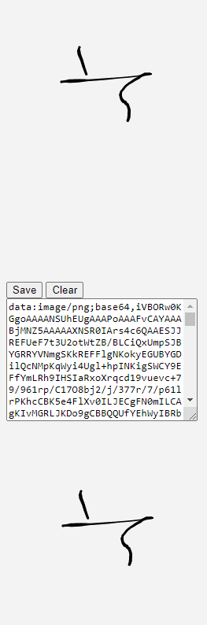

# javascript

Repositório responsável por armazenamento de códigos de apoio JavaScript

<a href="https://github.com/PatrickCavalcant/javascript/tree/main/assinatura-manual"><h3>Assinatura</h3></a>

    

<a href="https://github.com/PatrickCavalcant/javascript/tree/main/funcao-geolocalizao"><h3>Mapa Luziânia</h3>
  

    
  

