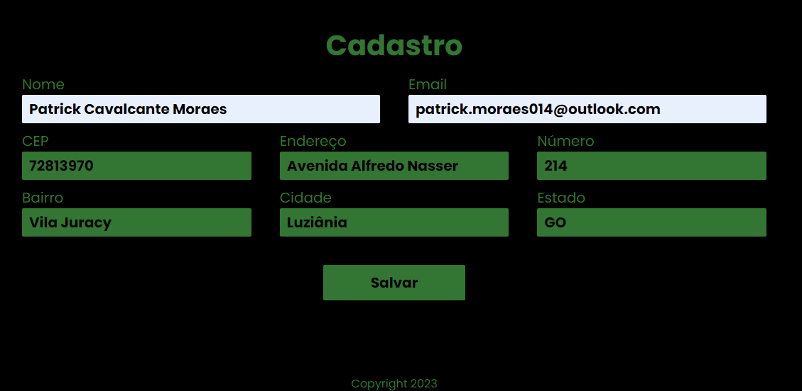
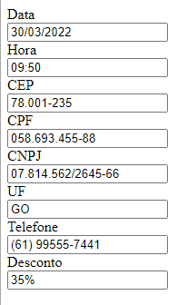
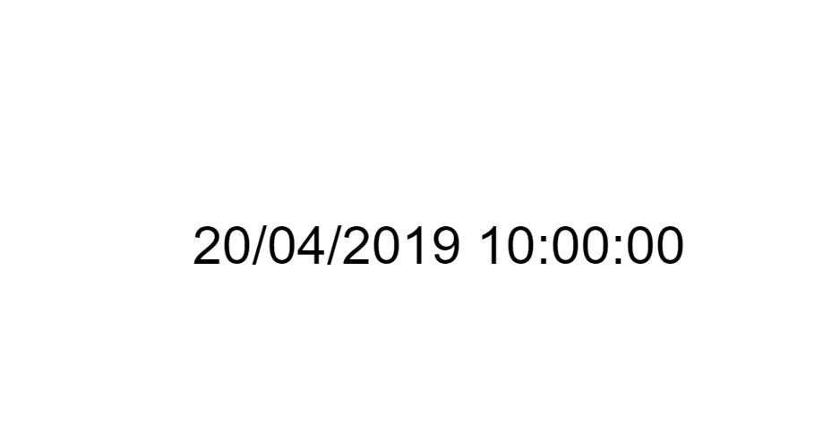

# Javascript
[](https://www.linkedin.com/in/patrick-cavalcante-moraes-a95635179/)
[](https://github.com/PatrickCavalcant)

Repositório responsável por armazenamento de códigos de apoio JavaScript


# Consumo de API usando Javascript

| #  | Projeto | 
| --- | ------ | 
| 1. | Consumir uma API de CEP e preencher um formulário como as informações do endereço.| 
| 2. | Consumir uma API de imagens e criar uma pesquisa retornando uma galeria com as imagens. |


<a href="https://github.com/PatrickCavalcant/javascript/tree/main/assinatura-manual"><h3>Assinatura</h3></a><hr>
<p align="center">
    
</p>


<a href="https://github.com/PatrickCavalcant/javascript/tree/main/funcao-geolocalizao"><h3>Mapa Luziânia</h3></a><hr>
  <p align="center">
    
  </p>
  

<a href="https://github.com/PatrickCavalcant/javascript/tree/main/mask"><h3>Mascaras com jQuery Mask Plugin</h3></a><hr>  
Mascaras de jQuery Mask Plugin do autor Igor Escobar
  <p align="center">
    
  </p>
  

<a href="https://github.com/PatrickCavalcant/javascript/tree/main/subtrair-somar-data-tempo"><h3>Subtrair e Somar Data e Tempo</h3></a><hr>  
  <p align="center">
    
  </p>
  

<h3>Converte datas</h3><hr> 

```
var tempo = datasetProcessTask['values'][0]['endDate'] //Data em milisegundo 1645717317752
date = new Date(tempo); //Converte para 'Thu Feb 24 2022 12:41:57 GMT-0300 (Horário Padrão de Brasília)'
new Intl.DateTimeFormat('pt-BR').format(date) //Converte para 24/02/2022
```    

